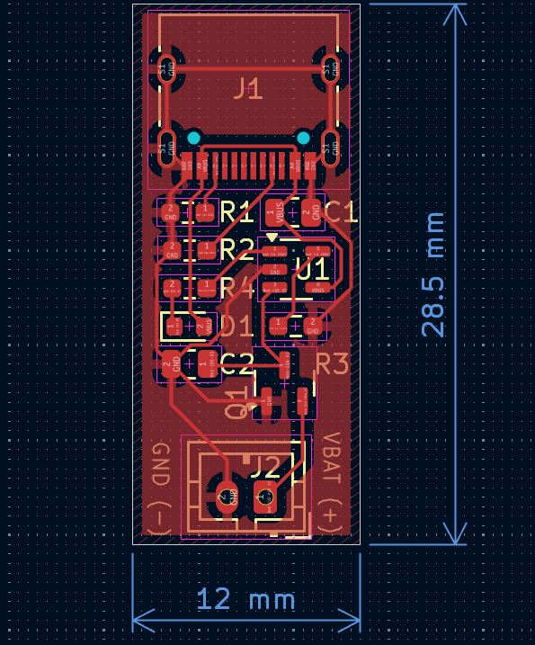
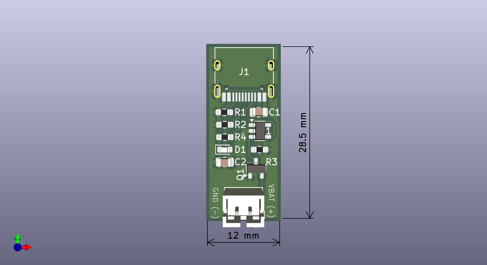

# USB-C LiPo Charger

A minimal, single-cell (1S) LiPo battery charger powered by a USB-C input. This project is designed to be a simple, low-cost, and compact charging solution for hobbyist electronics.

[Download the full Schematic (PDF)](USB-C-LiPo-Charger_sch.pdf)

## 🚀 Project Overview
This circuit provides a safe and reliable way to charge 1S LiPo batteries using any standard 5V USB-C power source. It's built around the **MCP73831** charge controller, which handles the complete charging algorithm (pre-conditioning, constant current, constant voltage) to protect the battery.

## ✨ Features

* **Input:** USB-C (5V)
* **Charge Controller:** MCP73831 (or LTH7R)
* **Charge Current:** 500mA (set by a single resistor, R3)
* **Output:** 2-pin JST-PH Connector for 1S LiPo batteries
* **Indicator:** On-board 'Charging' status LED (On when charging, Off when complete)
* **Protection:** Utilizes the MCP73831's internal safety features and Si2319CDS for reverse polarity protection.

## ⚡ Schematic

The circuit is intentionally simple, requiring only the charge controller, a USB-C port, and a few passive components.

## 🛠️ Fabrication

The Gerbers files (`.gbr` and `.drl`) needed to manufacture this PCB are located in the `/gerbers` directory of this repository. You can upload the `.zip` file from that folder directly to any PCB manufacturer (like JLCPCB, PCBWay, etc.).

<<<<<<< HEAD
* **PCB Dimensions:** [12mm x 28.5mm]
=======
* **PCB Dimensions:** [13mm x 26.5mm]
>>>>>>> 7d117bfd03760160a18be7479f4834133a8773e7
* **Layers:** 2 (Top and Bottom)
* **Default Copper:** 1 oz/ft²

## 📜 License

This project is open-source. Feel free to use, modify, and distribute it.

---
*Project by Miguel San Martin*
